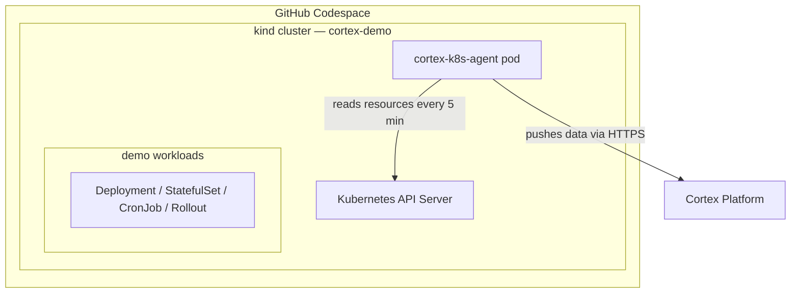

# Kubernetes Agent Solution

Demonstrates the [Cortex Kubernetes agent](https://docs.cortex.io/docs/reference/integrations/kubernetes) integration. Supports two deployment paths:

- **GitHub Codespace** — creates a Codespace with a local [kind](https://kind.sigs.k8s.io) cluster automatically (no cluster setup required)
- **Existing cluster** — deploys to any Kubernetes cluster already configured in your `kubectl` context

## What this installs

- **Cortex k8s-agent** — connects your cluster to Cortex and syncs workload metadata
- **Demo workloads** — Deployment, StatefulSet, CronJob, and Argo Rollout, all tagged `demo-kubernetes`
- **demo-kubernetes** — a Cortex service entity that the workloads annotate to

After setup, visit your entity's K8s tab to see live workload data synced from the cluster.

## Architecture



The agent runs inside the kind cluster as a Kubernetes Deployment. Every 5 minutes it queries the Kubernetes API for workload resources (Deployments, StatefulSets, CronJobs, Argo Rollouts, etc.) and pushes the collected metadata to the Cortex API over HTTPS. Cortex stores the data and surfaces it on each entity's K8s tab.

## Prerequisites

- A Cortex API key (`CORTEX_API_KEY`) — get from Cortex Settings → API Keys
- A GitHub PAT provided by Cortex Customer Engineering (`GHCR_TOKEN`) — required to pull the k8s-agent image; see [Kubernetes prerequisites](https://docs.cortex.io/ingesting-data-into-cortex/integrations/kubernetes#prerequisites)

**For the GitHub Codespace path only:**
- The [gh CLI](https://cli.github.com) installed and authenticated (`gh auth login`)

**For the existing cluster path only:**
- `kubectl`, `helm` installed and configured to reach your cluster

## Quick start

```bash
cortex solutions install -s kubernetes-agent
cortex solutions post-install -s kubernetes-agent
```

The setup script will ask which path you want:

```
Create a new GitHub Codespace with a kind cluster? (yes = spin up Codespace, no = use an existing configured cluster) [yes]:
```

### GitHub Codespace path

The script will:
1. Create a Codespace from the `cortexapps/cli` repository using the `kubernetes-agent` devcontainer
2. Wait for the Codespace to start and the kind cluster to initialize (~15-20 min on first run)
3. Deploy the k8s-agent and demo workloads inside the Codespace via `gh codespace ssh`

After setup, the Codespace URL and `gh codespace ssh` command are printed.

### Existing cluster path

Requires `kubectl` pointed at a running cluster. The script deploys the k8s-agent and demo workloads into whatever namespace your current context targets.

## What you should see

After the agent's first sync (~5 min), visit:
`https://app.getcortexapp.com/admin/resources?tag=demo-kubernetes`

- `demo-deployment` (Deployment)
- `demo-statefulset` (StatefulSet)
- `demo-cronjob` (CronJob)
- `demo-rollout` (Argo Rollout — containers resolved from `demo-deployment`)

## Re-running setup

The setup script is idempotent — re-run `cortex solutions post-install -s kubernetes-agent` to retry any failed step. Completed steps are skipped.

For the Codespace path, the Codespace name is saved locally so re-runs reconnect to the same Codespace rather than creating a new one.

## Temporary limitation

The k8s-agent image is currently private on GHCR, requiring `GHCR_TOKEN`. This requirement will be removed once the image is made public.
