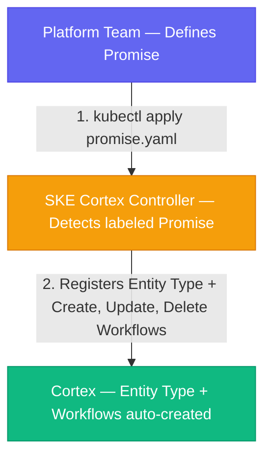
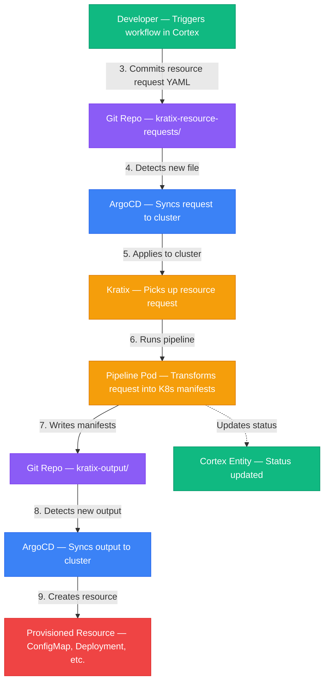
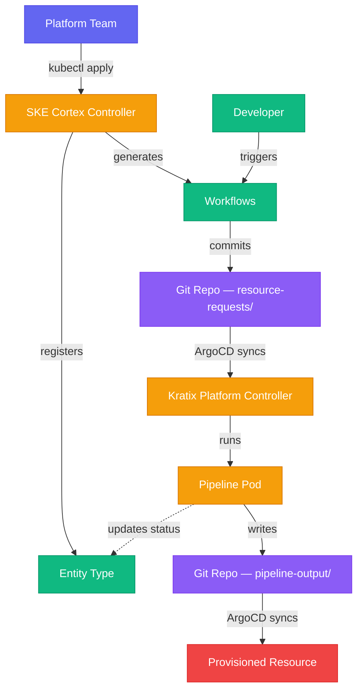

# SKE + Cortex Integration Flow

## How it works

When a platform team installs an SKE Promise with the `kratix.io/cortex: "true"` label, the **SKE Cortex Controller** automatically registers the Promise as an Entity Type in Cortex and generates Create, Update, and Delete workflows. Developers then use Cortex to request and manage platform resources without needing direct Kubernetes access.

**What is a Promise?** A Promise is a YAML file with two parts: (1) an **API** — a Kubernetes CRD that defines the fields developers fill in (e.g. `spec.message`, `spec.size`), and (2) a **Pipeline** — a container image that transforms the developer's input into real Kubernetes resources (e.g. a ConfigMap, Deployment, or database).

### Setup (one-time)

### Request lifecycle

### Color key

| Color | Component |
|-------|-----------|
| **Purple** | Git Repository |
| **Blue** | ArgoCD (GitOps sync) |
| **Yellow** | Kratix / SKE (Kubernetes) |
| **Green** | Cortex (Developer Portal) |
| **Red** | Final provisioned resource |

## Step by step

1. **Platform team** defines a Promise (API + pipeline) and applies it to the cluster
2. **SKE Cortex Controller** detects the `kratix.io/cortex: "true"` label and creates an Entity Type and Workflows in Cortex
3. **Developer** opens Cortex, finds the service, and runs a workflow (e.g. "Create Message")
4. **Cortex workflow** commits a resource request YAML to the Git repository
5. **ArgoCD** detects the new file and syncs it to the Kubernetes cluster
6. **Kratix** picks up the resource request and runs the pipeline pod
7. **Pipeline** transforms the request into Kubernetes manifests and writes them to Git
8. **ArgoCD** syncs the pipeline output back to the cluster
9. **Resource** is created on the cluster and status is synced back to the Cortex entity

## Architecture overview

